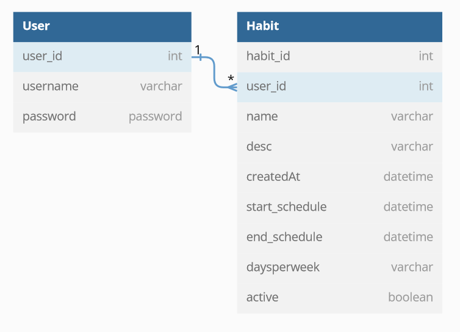

# Tables design

```sql
Table User {
  user_id int
  username varchar 
  password password
}


Table Habit{
  habit_id int
  user_id int [ref: > User.user_id ] 
  name varchar
  desc varchar
  createdAt datetime
  start_schedule datetime
  end_schedule datetime
  daysperweek varchar
  active boolean
}
```



```php artisan make:model Habit -c -m -f --api ```